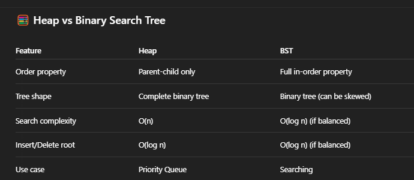

A Heap is a special kind of binary tree-based data structure that satisfies the heap property.

🧩 Types of Heaps
There are two main types:

1. Min Heap
   The parent node is always less than or equal to its children.

The smallest element is at the root.

2. Max Heap
   The parent node is always greater than or equal to its children.

The largest element is at the root.

✅ Properties of a Heap
Complete Binary Tree:

All levels are completely filled except possibly the last level, which is filled left to right.

Heap Property:

Maintains order between parent and children:

Min Heap: parent <= child

Max Heap: parent >= child

Use Cases
Priority Queue (Java’s PriorityQueue uses Min Heap)

Dijkstra’s Algorithm

Heap Sort

Median finder

Task schedulers

Streaming k largest/smallest elements