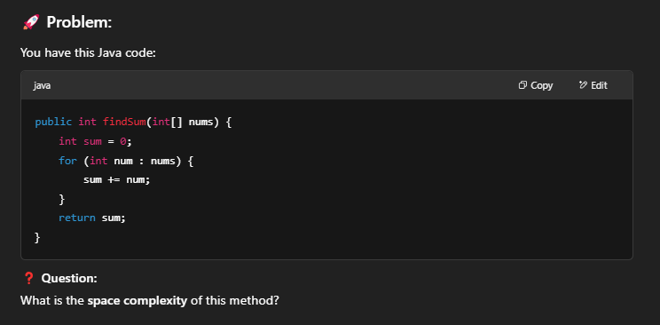

When can i find space complexity of O(1) in a fixed array ? 

✅ You get space complexity O(1) when your algorithm does NOT use extra memory that grows with input size.

In simpler words:

You are only using a fixed number of variables or memory locations.

No new data structures (like lists, queues, trees) based on input size.

📦 Example: Using a Fixed Array
Suppose you have a fixed-size array, like:

`int[] arr = new int[10];`

And you just update or read elements, like:

`for (int i = 0; i < 10; i++) {
arr[i] = i * i;
}`

Space complexity here is O(1) because:

The array has a fixed size (10), independent of input.

You are not creating anything that grows dynamically.

🔵 Important:

Fixed array size = constant space = O(1) space complexity.

Variable array size based on input = O(N) space complexity.

When it's NOT O(1):
If you create an array based on input size:

`int[] arr = new int[n];` 
 n depends on input
Space complexity = O(N) 🚨

Because if input gets bigger, memory usage grows too.

Final Tips:
Fixed size array → O(1) ✅

Dynamic size array (depending on input) → O(N) ❌

"In-place" algorithms (modifying input directly without extra structures) → usually O(1) space.

Exercise

`public int findSum(int[] nums) {
int sum = 0;
for (int num : nums) {
sum += num;
}
return sum;
}`

What is the space complexity of this method?

Observation:

nums is given as a parameter — you're not creating extra space for it.

sum is just one integer (int sum = 0).

The for-each loop uses a small temporary variable num, but that is O(1) space.

✅ Answer:
→ Space Complexity is O(1)

Why?
Because no matter how big nums is, you are not creating any new big structures — only a few primitive variables (sum, num).

2.
  

`public int[] doubleElements(int[] nums) {
int[] result = new int[nums.length];
for (int i = 0; i < nums.length; i++) {
result[i] = nums[i] * 2;
}
return result;
}`

Observation:

Here, you're creating a new array result of size n (where n is nums.length).

So you need extra memory proportional to the input size.

✅ Answer:
→ Space Complexity is O(n)

Why?
Because for each element in the input, you create one in the output (result array).

🌟 About your doubt:
if nums is fixed or dynamically created...

It does not matter who created nums!

Space complexity cares only about what your function creates during execution.

Since you receive nums, it's outside your calculation.
You only worry about extra memory your code creates.
   