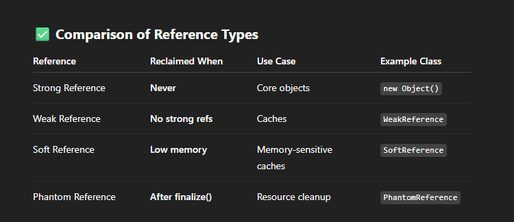

How to Avoid Memory Leaks with Strong References?
Set the Reference to null when it is no longer needed.

Use WeakReferences or SoftReferences for cache or temporary data.

Use data structures like WeakHashMap, which automatically removes entries when keys are no longer strongly reachable.

Avoid static references to large objects, as they remain accessible throughout the application lifecycle.